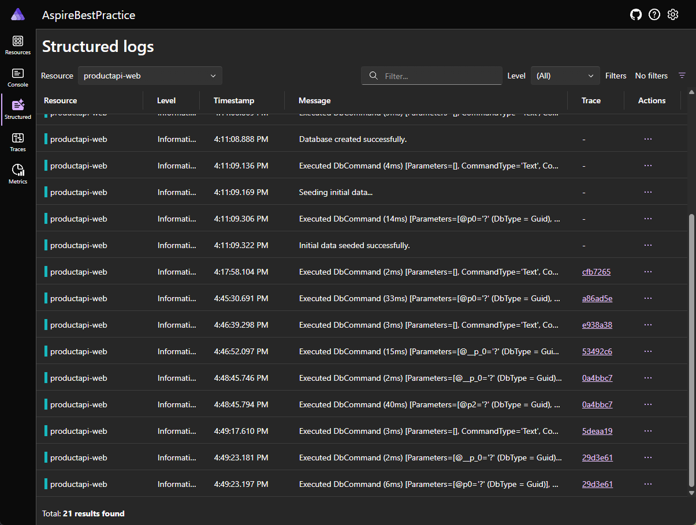
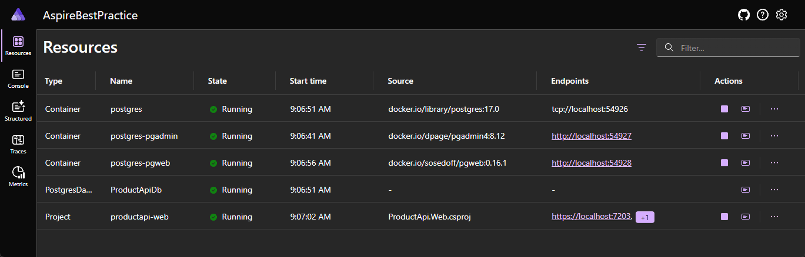

# Building enterprise class web API using ASP.NET Core with .NET 9.0
---

 <details>

 <summary>Click for screenshots</summary>

<!--## Screenshots-->
[Aspire](https://learn.microsoft.com/en-us/dotnet/aspire/get-started/aspire-overview) main orchestration page

[Scalar](https://scalar.com/) Web Api Documentation page

Docker Desktop 

Get all products

Get a product by Id

Create a product

Update a product

Delete a product

Console logs

Structure logs

Traces


Metrics

pgAdmin

pgWeb

 --- 

</details>

## Objective 

The primary objective of this project is to develop an enterprise-class Web API using ASP.NET Core with .NET 9.0, adhering to industry-leading practices and leveraging cutting-edge technologies. The project will be structured and implemented following a robust foundation built on:  

- **Clean Architecture** and **Domain-Driven Design (DDD)** for maintainable and scalable solutions.  
- **CQRS (Command Query Responsibility Segregation)** for clear separation of concerns.  
- **Repository Pattern** and **Unit of Work** for efficient data access and transactional consistency.  
- **Mediator Pattern** for streamlined communication between components.  
- **Fluent Validation** for clean and reusable validation logic.  
- Comprehensive **exception handling** to ensure resilience and reliability.  
- Advanced **logging** for diagnostics and monitoring.  
- **API Versioning** for backward compatibility and smooth evolution.  
- **Response Caching** to enhance performance.  
- **Health Checks** to monitor application status.  
- **Entity Framework Core** for robust ORM capabilities with **SQL Server** as the database.  
- **AutoMapper** for object-to-object mapping.  
- **FluentAssertions**, **Moq**, and **xUnit** for effective unit testing and ensuring code quality.  
- **Scalar/OpenAPI** for API documentation and client consumption.  
- **Docker** for containerization and portability.  
- **GitHub Actions** and **Azure DevOps** for CI/CD pipelines and deployment automation.  

This combination of design principles, frameworks, and tools will ensure the API is robust, scalable, testable, and production-ready.  

--- 

## Overview
 - The project will be a simple CRUD operation for a product entity.
 - The project will have the following operations:
   - Get all products
   - Get a product by Id
   - Create a product
   - Update a product
   - Delete a product
 - The product entity should has the following properties:
   ```csharp
   public class Product
   {
	   public int Id { get; set; }
	   public string Name { get; set; }
	   public decimal Price { get; set; }
   }
   ```
 - The project should looks something like this

 - As of now, this project does not cover securing your Web Api. For securing enterprise-class Web API, check out [OWASP](https://cheatsheetseries.owasp.org/cheatsheets/DotNet_Security_Cheat_Sheet.html).

 --- 

 ## Running the project

You need the following installed locally:
- .NET 9.0
- Docker Desktop 
- Visual Studio 2022

Open the solution in Visual Studio 2022 and run the project. The project will be accessible here [https://localhost:17244/](https://localhost:17244/).

Scalar Web API documentation is accessible here [https://localhost:7203/scalar/v1](https://localhost:7203/scalar/v1).

Do note that the port number might vary.

 --- 

## Basic project features
- Aspire orchestration features
	- Listing of Aspire resources

	- Console logs of each resources

	- Structured view of logs for each projects

	- Traces

	- Metrics

- Scalar Web API documentation features
	- Get all products

	- Get a product by Id

	- Create a product

	- Update a product

	- Delete a product

	- Models information

- Product model class
[Product.cs](src/ProductApi.Domain/Entities/Product.cs)
- Database context
[AppDbContext.cs](src/ProductApi.Infrastructure/Data/AppDbContext.cs)
- Controller
[ProductController.cs](src/ProductApi.Api/Controllers/ProductController.cs)
- Service
[ProductService.cs](src/ProductApi.Application/Services/ProductService.cs)

 --- 

## Technology And Best Practices
- [X] Leverage .NET Aspire for orchestrating distributed applications
	- [X] Monitoring
	- [X] Logging
	- [X] Orchestration
- [X] Leverage Scalar for API documentation
- [X] Clean Architecture
	- [X] Presentation (ProductApi.Web)
	- [X] Application (ProductApi.Application)
	- [X] Domain (ProductApi.Domain)
	- [X] Infrastructure (ProductApi.Infrastructure)
- [X] Domain Driven Design
	- [X] Domain logic in Product entity

	```
	public class Product : Entity
	{
		public string Name { get; private set; }
		public decimal Price { get; private set; }

		public Product(string name, decimal price)
		{
			Name = name;
			Price = price;
		}
	```

	- [X] Application logic in ProductService

	```
	public interface IProductService
	{
		Task<IEnumerable<Product>> GetProductsAsync();
		Task<Product> GetProductByIdAsync(int id);
	```

- [X] Gerenric Repository Pattern
- [X] Data Transfer Object
	- [X] Uses record
	```
	public record CreateProductDto(string Name, decimal Price);
	```
	- [X] Separated Request and Response
	```
	- ProductApi.Application
	  - DTOs
		- Requests
		  - CreateProductDto.cs
		  - UpdateProductDto.cs
		- Responses
		  - ProductDto.cs
	```
